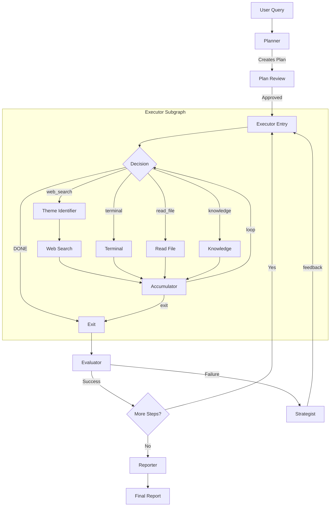

# Deep Research — Automated Research System

A **FastAPI + React** application for deep automated research powered by **LangGraph**. The system uses a multi-agent architecture for planning, executing, and analyzing research tasks with support for parallel web searches, terminal command execution, and report generation.

## Key Features

- **LangGraph Multi-Agent Architecture**: Specialized agents (Planner, Executor Subgraph, Evaluator, Strategist, Reporter) work together using a StateGraph
- **Flexible Executor Subgraph**: Multi-tool executor supporting web search, terminal commands, file reading, and LLM knowledge with an iterative loop
- **Parallel Search**: Execute multiple web searches simultaneously using LangGraph's Send API (fan-out/fan-in by themes)
- **Checkpoint Persistence**: Built-in pause/resume with AsyncSqliteSaver — stop research and continue later
- **Human-in-the-Loop**: Command approval system with interrupt_before/after for secure terminal execution
- **Real-time Updates**: WebSocket streaming for live progress in the React UI
- **Multi-user Support**: JWT authentication with isolated research sessions per user
- **Intelligent Search**: SearXNG integration with bi-encoder and cross-encoder filtering

## Requirements

- Python 3.11+
- Node.js 20+
- Docker (for SearXNG)

## Quick Start

### 1. Install Backend

```bash
# Create virtual environment
python -m venv .venv
source .venv/bin/activate

# Install dependencies
pip install -e .
```

### 2. Install Frontend

```bash
cd frontend
npm install
```

### 3. Configure Environment

Create a `.env` file in the project root:

```bash
# LLM Configuration
LLM_BASE_URL=http://localhost:1234/v1   # Or your OpenAI-compatible endpoint
LLM_API_KEY=your-api-key
LLM_MODEL=gpt-4

# Auth
JWT_SECRET_KEY=your-secret-key-change-in-production

# Search (optional)
SEARXNG_URL=http://localhost:8080
FIRECRAWL_API_KEY=your-firecrawl-key   # Optional, for enhanced scraping

# Database paths (optional, defaults shown)
DATABASE_PATH=db/app.db
LANGGRAPH_CHECKPOINT_PATH=db/langgraph.db
```

### 4. Start Services

```bash
# Terminal 1: Start SearXNG
cd infrastructure
docker-compose up searxng

# Terminal 2: Start Backend
uvicorn backend.main:app --reload

# Terminal 3: Start Frontend
cd frontend
npm run dev
```

Open http://localhost:5173 in your browser.

## Docker Deployment

Run everything with Docker Compose:

```bash
cd infrastructure
docker-compose up --build
```

This starts:
- **Backend** on http://localhost:8000
- **Frontend** on http://localhost:5173
- **SearXNG** on http://localhost:8080

## Architecture

### System Overview

```
┌─────────────────────────────────────────────────────────────────┐
│                         React Frontend                          │
│  ┌─────────────┐  ┌─────────────┐  ┌─────────────────────────┐  │
│  │  Auth Pages │  │  Research   │  │       Sidebar           │  │
│  │             │  │    Chat     │  │  - Plan View            │  │
│  │             │  │             │  │  - Run List             │  │
│  │             │  │             │  │  - Approval Panel       │  │
│  └─────────────┘  └─────────────┘  └─────────────────────────┘  │
└────────────────────────────┬────────────────────────────────────┘
                             │ HTTP/WebSocket
┌────────────────────────────▼────────────────────────────────────┐
│                       FastAPI Backend                           │
│  ┌─────────────┐  ┌─────────────┐  ┌─────────────────────────┐  │
│  │  REST API   │  │  WebSocket  │  │      Services           │  │
│  │  - /auth    │  │  Manager    │  │  - ResearchService      │  │
│  │  - /runs    │  │             │  │  - NotificationService  │  │
│  │  - /research│  │             │  │                         │  │
│  └─────────────┘  └─────────────┘  └─────────────────────────┘  │
└────────────────────────────┬────────────────────────────────────┘
                             │
┌────────────────────────────▼────────────────────────────────────┐
│                     LangGraph StateGraph                        │
│                                                                 │
│    ┌──────────┐    ┌──────────────────────────────────────┐    │
│    │ Planner  │───▶│         Executor Subgraph            │    │
│    └──────────┘    │  ┌───────┐   ┌─────────────────────┐ │    │
│                    │  │ Entry │──▶│      Decision       │ │    │
│                    │  └───────┘   └──────────┬──────────┘ │    │
│                    │         ┌───────┬───────┼───────┐    │    │
│                    │         ▼       ▼       ▼       ▼    │    │
│                    │   theme_id  terminal  read   know    │    │
│                    │     ↓         │       │       │      │    │
│                    │  web_search   │       │       │      │    │
│                    │     │         │       │       │      │    │
│                    │     └─────────┴───────┴───────┘      │    │
│                    │                    ▼                 │    │
│                    │  ┌─────────────────────────────────┐ │    │
│                    │  │     Accumulator (loop/exit)     │ │    │
│                    │  └─────────────────────────────────┘ │    │
│                    └──────────────────┬───────────────────┘    │
│                                       ▼                        │
│    ┌──────────┐    ┌───────────┐    ┌──────────┐              │
│    │Strategist│◀───│ Evaluator │◀───│   Exit   │              │
│    └────┬─────┘    └───────────┘    └──────────┘              │
│         │ feedback                                             │
│         └──────────────────────────────┐                       │
│                    ┌──────────┐        ▼                       │
│                    │ Reporter │◀─── Executor                   │
│                    └──────────┘                                │
│                                                                 │
│  ┌─────────────────────────────────────────────────────────┐   │
│  │              AsyncSqliteSaver (Checkpointing)           │   │
│  └─────────────────────────────────────────────────────────┘   │
└─────────────────────────────────────────────────────────────────┘
```

### Multi-Agent Architecture

The system uses **LangGraph StateGraph** with specialized agents and a flexible executor subgraph:

#### 1. Planner
- **Role**: Creates a structured research plan (3-10 steps)
- **Output**: Plan with specific research tasks
- **Interrupt**: After planning for user review

#### 2. Executor Subgraph
A flexible multi-tool subgraph that replaces the simple search chain. Supports iterative tool use with a configurable call limit.

**Components:**
- **Entry**: Discovers current step, initializes executor state, preserves strategist feedback
- **Decision**: LLM-based tool selection that sees feedback from previous failed attempts
- **Tools**:
  - `web_search` — Parallel web searches via Send API (through theme_identifier)
  - `terminal` — Shell command execution (with approval support)
  - `read_file` — Local file reading with line range support
  - `knowledge` — LLM built-in knowledge for established facts
- **Theme Identifier**: Generates search queries for web_search (only called when web_search is chosen)
- **Accumulator**: Collects results and decides to loop or exit
- **Exit**: Prepares findings for the evaluator

**Flow:**
```
entry → decision → [tool path] → accumulator → decision (loop) or exit
                      ↓
        web_search: theme_identifier → search_dispatcher → ...
        terminal: terminal_prepare → terminal_execute → ...
        other tools: direct execution
```

**Configuration:**
| Parameter | Default | Description |
|-----------|---------|-------------|
| `max_executor_calls` | 5 | Maximum tool calls per step |
| `max_file_read_chars` | 50000 | File reading character limit |
| `terminal_output_limit` | 2000 | Terminal output truncation |

#### 3. Evaluator
- **Role**: Validates research findings for each step
- **Decisions**:
  - `APPROVE` → Findings sufficient, mark step DONE, continue to next
  - `FAIL` → Findings insufficient, trigger Strategist for recovery (if budget remains)
  - `SKIP` → Step not critical, mark SKIPPED, continue to next

#### 4. Strategist
- **Role**: Recovery from failed executor attempts
- **Actions**: Analyzes tool history and generates structured feedback for decision node
- **Output**: Feedback in `last_error` explaining what went wrong and what to try differently
- **Trigger**: Only when Evaluator returns FAIL and substep budget not exhausted

#### 5. Reporter
- **Role**: Generate final research report
- **Output**: Comprehensive Markdown report synthesizing all findings

### Per-Step Recovery (Substeps)

Each plan step has a **recovery budget** (`max_substeps`, default: 3). When a search fails to produce adequate findings, the system retries with different queries instead of immediately failing the entire step.

```
PlanStep {
    id: 0,
    description: "Research X",
    status: "IN_PROGRESS",
    substeps: [                         # History of attempts
        {id: 0, queries: [...], status: "FAILED"},
        {id: 1, queries: [...], status: "FAILED"},
    ],
    current_substep_index: 2,           # Next attempt
    max_substeps: 3,                    # Budget
    accumulated_findings: [...]         # Partial findings from all attempts
}
```

**Recovery Flow:**

```
┌─────────────────────────────────────────────────────────────────────┐
│                        Step 0: "Research X"                         │
├─────────────────────────────────────────────────────────────────────┤
│                                                                     │
│  Attempt 0 (initial):                                               │
│    entry → decision (picks web_search)                              │
│    theme_identifier → ["query A", "query B"]                        │
│    search (parallel) → findings                                     │
│    evaluator → FAIL (insufficient)                                  │
│         │                                                           │
│         ▼                                                           │
│  Attempt 1 (recovery with feedback):                                │
│    strategist → generates feedback: "web_search missed X, try Y"    │
│    entry → decision (sees feedback, may pick different tool)        │
│    [tool execution] → more findings                                 │
│    evaluator → FAIL (still insufficient)                            │
│         │                                                           │
│         ▼                                                           │
│  Attempt 2 (last chance):                                           │
│    strategist → updated feedback based on all attempts              │
│    entry → decision (sees full history analysis)                    │
│    [tool execution] → findings                                      │
│    evaluator → APPROVE (or budget exhausted → FAILED)               │
│                                                                     │
└─────────────────────────────────────────────────────────────────────┘
```

**Configuration** (in `backend/core/config.py` → `ResearchSettings`):

| Parameter | Env Variable | Default | Description |
|-----------|--------------|---------|-------------|
| `min_plan_steps` | `RESEARCH_MIN_PLAN_STEPS` | 3 | Minimum steps in research plan |
| `max_plan_steps` | `RESEARCH_MAX_PLAN_STEPS` | 10 | Maximum steps in research plan |
| `max_substeps` | `RESEARCH_MAX_SUBSTEPS` | 3 | Recovery attempts per step |
| `max_searches_per_step` | `RESEARCH_MAX_SEARCHES_PER_STEP` | 3 | Parallel searches per substep |

### Execution Flow



### State Schema

```python
class ResearchState(TypedDict):
    messages: Annotated[list, add_messages]  # Conversation history
    plan: list[PlanStep]                     # Research plan
    current_step_index: int                  # Active step
    phase: Literal["planning", "executing", "evaluating", ...]
    search_themes: list[str]                 # Themes for parallel search
    parallel_search_results: list[SearchResult]  # Fan-in results
    step_findings: list[str]                 # Accumulated findings
    pending_approval: Optional[dict]         # Command awaiting approval

    # Executor Subgraph State
    executor_tool_history: list[ExecutorToolCall]  # Tool call records
    executor_call_count: int                       # Calls in current cycle
    max_executor_calls: int                        # Limit (default 5)
    executor_decision: Optional[ExecutorDecision]  # Decision node's choice
    pending_terminal: Optional[dict]               # Terminal awaiting approval
    last_error: Optional[str]                      # Feedback from strategist (for retry)

    run_id: str
    user_id: str

class ExecutorToolCall(TypedDict):
    id: int
    tool: Literal["web_search", "terminal", "read_file", "knowledge"]
    params: dict
    result: Optional[str]
    success: bool
    error: Optional[str]

class ExecutorDecision(TypedDict):
    reasoning: str
    decision: Literal["web_search", "terminal", "read_file", "knowledge", "DONE"]
    params: dict
```

### State Reducers

LangGraph uses **reducers** to merge updates from multiple nodes into the state. Reducers are attached to fields via `Annotated[Type, reducer_func]`.

| Field | Reducer | Behavior |
|-------|---------|----------|
| `messages` | `add_messages` | Appends new messages to history |
| `parallel_search_results` | `merge_search_results` | Merges results during fan-in; `None` resets to `[]` |
| `step_findings` | `replace_findings` | Last write wins (prevents accumulation) |
| `step_search_count` | `add_or_reset_count` | Increments; `0` resets |
| `plan`, `phase`, `current_step_index` | `last_value` / `replace_plan` | Last write wins |
| `executor_tool_history` | `append_or_reset_tool_history` | Appends single item; list replaces; `None` resets |
| `executor_call_count` | `add_or_reset_count` | Increments; `0` resets |
| `executor_decision`, `pending_terminal` | `last_value` | Last write wins |
| `last_error` | `last_value` | Strategist feedback for decision node |

**Example: Parallel Search Fan-out/Fan-in**

```
identify_themes returns: {search_themes: ["q1", "q2", "q3"]}
                              │
            ┌─────────────────┼─────────────────┐
            ▼                 ▼                 ▼
      search_node #1    search_node #2    search_node #3
      returns: {        returns: {        returns: {
        parallel_         parallel_         parallel_
        search_results:   search_results:   search_results:
        [r1]              [r2]              [r3]
      }                 }                 }
            │                 │                 │
            └─────────────────┼─────────────────┘
                              ▼
                    REDUCER merges:
                    [] + [r1] → [r1]
                    [r1] + [r2] → [r1, r2]
                    [r1, r2] + [r3] → [r1, r2, r3]
                              │
                              ▼
                    merge_results_node
                    returns: {parallel_search_results: None}
                              │
                              ▼
                    REDUCER resets:
                    merge([r1,r2,r3], None) → []
```

## Project Structure & Module Roles

The project is divided into a **FastAPI backend** and a **React frontend**, with a clear separation of concerns between agent orchestration, API delivery, and user interface.

### 📂 Backend (`/backend`)

The backend follows a service-oriented architecture, with LangGraph handling the complex agentic workflows.

#### 🤖 Agent System (`backend/agents/`)
Core orchestration logic using LangGraph.
- **`graph.py`**: The "brain" of the system. Defines the `StateGraph`, connecting nodes (agents) with edges and conditional routing logic.
- **`state.py`**: Defines `ResearchState`, the shared data structure that agents read from and write to during a research run.
- **`routing.py`**: Contains the logic for "conditional edges" — determining the next node based on the current state (e.g., whether to retry a search or move to reporting).
- **`nodes/`**: Individual functional units of the workflow.
    - `planner.py`: Breaks down high-level queries into a sequence of actionable research steps.
    - `executor.py`: Prepares context for the current step and identifies specific search themes.
    - `search.py`: Executes web searches and merges results into the state findings.
    - `evaluator.py`: Critically assesses findings against step goals to determine completion or failure.
    - `strategist.py`: Handles recovery logic, analyzing failed attempts and generating structured feedback for the executor's decision node.
    - `reporter.py`: Synthesizes all accumulated findings into a final, structured Markdown report.
- **`executor/`**: Flexible multi-tool executor subgraph.
    - `subgraph.py`: Builds and assembles the executor subgraph with all nodes and edges.
    - `routing.py`: Conditional edge functions for tool routing and loop control.
    - `nodes/lifecycle/`: Entry (step discovery, state init) and Exit nodes.
    - `nodes/routing/`: Decision node (LLM tool selection with feedback awareness).
    - `nodes/search/`: Theme identifier and search workflow nodes.
    - `nodes/tools/`: Terminal, file reader, and knowledge tool nodes.
- **`parallel/`**: Logic for concurrent operations.
    - `search_fanout.py`: Uses LangGraph's `Send` API to trigger multiple search nodes in parallel for different themes.

#### 🔌 API Layer (`backend/api/`)
Handles communication with the outside world.
- **`routes/`**: RESTful endpoints for authentication, research control, and data retrieval.
- **`websocket.py`**: Low-level WebSocket management for real-time bi-directional updates.
- **`dependencies.py`**: FastAPI dependencies for JWT validation, database sessions, and service injection.

#### 🛠️ Tools (`backend/tools/`)
Functional capabilities provided to agents.
- **`search.py`**: High-level interface for SearXNG and Firecrawl with built-in scraping logic.
- **`filesystem.py`**: Safe file operations and terminal command execution with human-in-the-loop protection.
- **`knowledge.py`**: Local RAG capabilities to answer questions from indexed research data.

#### 💼 Services (`backend/services/`)
High-level business logic and orchestration.
- **`research_service.py`**: Manages the lifecycle of research runs (start, pause, resume, cancel) and interfaces directly with the LangGraph.
- **`notification_service.py`**: Centralized hub for broadcasting events (phase changes, new messages, logs) to the frontend via WebSockets.

#### 🏗️ Core & Infrastructure
- **`core/`**: Global configuration (`config.py`), LLM provider setup (`llm.py`), and persistence checkpointers (`checkpointer.py`).
- **`persistence/`**: Database schema (`models.py`) and connection management (`database.py`) using SQLAlchemy and SQLite.
- **`ml/`**: Advanced text processing utilities (`text_processing.py`), including bi-encoder/cross-encoder models for result re-ranking.

---

### 💻 Frontend (`/frontend`)

A modern React application built with TypeScript, Vite, and Tailwind CSS.

- **`src/components/`**: UI components categorized by feature.
    - `Chat/`: The main research interface, handling message rendering and user input.
    - `Sidebar/`: Contextual panels for viewing the research plan, history, and pending approvals.
    - `Auth/`: User registration and login flows.
- **`src/stores/`**: Global state management using Zustand, separating `authStore` (user session) from `researchStore` (active run data).
- **`src/hooks/`**: Custom hooks encapsulating complex logic like WebSocket connectivity (`useWebSocket`) and research lifecycle management (`useResearch`).
- **`src/api/`**: Strongly typed API clients for both REST and WebSocket communication.

---

## API Reference

### Authentication

| Endpoint | Method | Description |
|----------|--------|-------------|
| `/auth/register` | POST | Register new user |
| `/auth/login` | POST | Login, returns JWT |
| `/auth/me` | GET | Get current user |

### Runs

| Endpoint | Method | Description |
|----------|--------|-------------|
| `/runs` | GET | List user's runs |
| `/runs` | POST | Create new run |
| `/runs/{id}` | GET | Get run details |
| `/runs/{id}` | DELETE | Delete run |

### Research Control

| Endpoint | Method | Description |
|----------|--------|-------------|
| `/research/start` | POST | Start/resume research |
| `/research/pause` | POST | Pause research |
| `/research/message` | POST | Send user message |
| `/research/state` | GET | Get current state |

### Approvals

| Endpoint | Method | Description |
|----------|--------|-------------|
| `/approvals/{run_id}/{hash}` | POST | Approve/deny command |

### WebSocket

Connect to `/ws/{run_id}` for real-time updates:

```typescript
// Event types
{ type: "phase_change", phase: "executing", step: 2 }
{ type: "message", role: "assistant", content: "..." }
{ type: "search_parallel", themes: ["theme1", "theme2"] }
{ type: "approval_needed", command: "ls -la", hash: "abc123" }
{ type: "step_complete", step: 2, status: "DONE" }
```

## Configuration

### Environment Variables

| Variable | Default | Description |
|----------|---------|-------------|
| `LLM_BASE_URL` | - | OpenAI-compatible API endpoint |
| `LLM_API_KEY` | - | API key for LLM |
| `LLM_MODEL` | `gpt-4` | Model to use |
| `JWT_SECRET_KEY` | - | Secret for JWT signing |
| `DATABASE_PATH` | `db/app.db` | SQLite database path |
| `LANGGRAPH_CHECKPOINT_PATH` | `db/langgraph.db` | LangGraph checkpoints |
| `SEARXNG_URL` | `http://localhost:8080` | SearXNG endpoint |
| `FIRECRAWL_API_KEY` | - | Firecrawl API key (optional) |
| `MAX_SEARCH_RESULTS` | `6` | Results per search |
| `MAX_FINAL_TOP_CHUNKS` | `3` | Top chunks after filtering |
| `RESEARCH_MIN_PLAN_STEPS` | `3` | Minimum steps in research plan |
| `RESEARCH_MAX_PLAN_STEPS` | `10` | Maximum steps in research plan |
| `RESEARCH_MAX_SUBSTEPS` | `3` | Recovery attempts per step |
| `RESEARCH_MAX_SEARCHES_PER_STEP` | `3` | Parallel searches per substep |
| `RESEARCH_MAX_EXECUTOR_CALLS` | `5` | Max tool calls per executor cycle |
| `RESEARCH_MAX_FILE_READ_CHARS` | `50000` | File read character limit |
| `RESEARCH_TERMINAL_OUTPUT_LIMIT` | `2000` | Terminal output truncation |

## Development

### Running Tests

```bash
# Backend tests
pytest tests/backend -v

# With coverage
pytest tests/backend --cov=backend --cov-report=html
```

### Code Quality

```bash
# Linting
ruff check backend/

# Type checking
mypy backend/
```

## Migration from Swarm

This project was migrated from OpenAI Swarm to LangGraph. Key changes:

| Feature | Swarm (Old) | LangGraph (New) |
|---------|-------------|-----------------|
| State Management | Custom `run_state` table | Built-in checkpointer |
| Persistence | Manual message saving | AsyncSqliteSaver |
| Parallelism | Sequential only | Send API fan-out |
| Human-in-Loop | Custom polling | interrupt_before/after |
| UI | Streamlit | React + WebSocket |
| API | Embedded in Streamlit | FastAPI REST |

The old implementation is preserved in `_legacy/` for reference.

## License

Pay me one gazillion dollars man