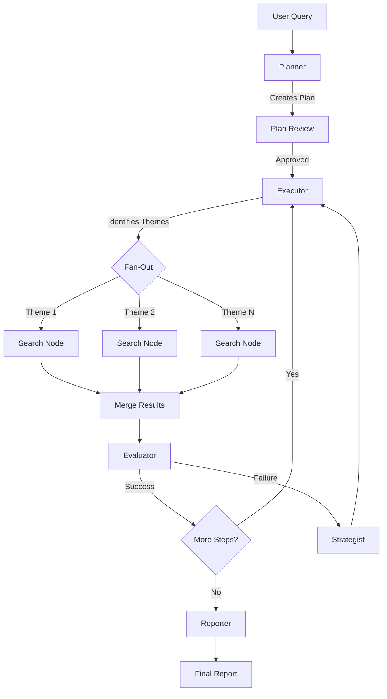

# Deep Research — Automated Research System

A **FastAPI + React** application for deep automated research powered by **LangGraph**. The system uses a multi-agent architecture for planning, executing, and analyzing research tasks with support for parallel web searches, terminal command execution, and report generation.

## Key Features

- **LangGraph Multi-Agent Architecture**: Five specialized agents (Planner, Executor, Evaluator, Strategist, Reporter) work together using a StateGraph
- **Parallel Search**: Execute multiple web searches simultaneously using LangGraph's Send API (fan-out/fan-in by themes)
- **Checkpoint Persistence**: Built-in pause/resume with AsyncSqliteSaver — stop research and continue later
- **Human-in-the-Loop**: Command approval system with interrupt_before/after for secure terminal execution
- **Real-time Updates**: WebSocket streaming for live progress in the React UI
- **Multi-user Support**: JWT authentication with isolated research sessions per user
- **Intelligent Search**: SearXNG integration with bi-encoder and cross-encoder filtering

## Requirements

- Python 3.11+
- Node.js 20+
- Docker (for SearXNG)

## Quick Start

### 1. Install Backend

```bash
# Create virtual environment
python -m venv .venv
source .venv/bin/activate

# Install dependencies
pip install -e .
```

### 2. Install Frontend

```bash
cd frontend
npm install
```

### 3. Configure Environment

Create a `.env` file in the project root:

```bash
# LLM Configuration
LLM_BASE_URL=http://localhost:1234/v1   # Or your OpenAI-compatible endpoint
LLM_API_KEY=your-api-key
LLM_MODEL=gpt-4

# Auth
JWT_SECRET_KEY=your-secret-key-change-in-production

# Search (optional)
SEARXNG_URL=http://localhost:8080
FIRECRAWL_API_KEY=your-firecrawl-key   # Optional, for enhanced scraping

# Database paths (optional, defaults shown)
DATABASE_PATH=db/app.db
LANGGRAPH_CHECKPOINT_PATH=db/langgraph.db
```

### 4. Start Services

```bash
# Terminal 1: Start SearXNG
cd infrastructure
docker-compose up searxng

# Terminal 2: Start Backend
uvicorn backend.main:app --reload

# Terminal 3: Start Frontend
cd frontend
npm run dev
```

Open http://localhost:5173 in your browser.

## Docker Deployment

Run everything with Docker Compose:

```bash
cd infrastructure
docker-compose up --build
```

This starts:
- **Backend** on http://localhost:8000
- **Frontend** on http://localhost:5173
- **SearXNG** on http://localhost:8080

## Architecture

### System Overview

```
┌─────────────────────────────────────────────────────────────────┐
│                         React Frontend                          │
│  ┌─────────────┐  ┌─────────────┐  ┌─────────────────────────┐  │
│  │  Auth Pages │  │  Research   │  │       Sidebar           │  │
│  │             │  │    Chat     │  │  - Plan View            │  │
│  │             │  │             │  │  - Run List             │  │
│  │             │  │             │  │  - Approval Panel       │  │
│  └─────────────┘  └─────────────┘  └─────────────────────────┘  │
└────────────────────────────┬────────────────────────────────────┘
                             │ HTTP/WebSocket
┌────────────────────────────▼────────────────────────────────────┐
│                       FastAPI Backend                           │
│  ┌─────────────┐  ┌─────────────┐  ┌─────────────────────────┐  │
│  │  REST API   │  │  WebSocket  │  │      Services           │  │
│  │  - /auth    │  │  Manager    │  │  - ResearchService      │  │
│  │  - /runs    │  │             │  │  - NotificationService  │  │
│  │  - /research│  │             │  │                         │  │
│  └─────────────┘  └─────────────┘  └─────────────────────────┘  │
└────────────────────────────┬────────────────────────────────────┘
                             │
┌────────────────────────────▼────────────────────────────────────┐
│                     LangGraph StateGraph                        │
│                                                                 │
│    ┌──────────┐    ┌──────────────────┐    ┌──────────┐        │
│    │ Planner  │───▶│  Parallel Search │───▶│ Evaluator│        │
│    └──────────┘    │  (Send API)      │    └────┬─────┘        │
│                    │  ┌────┐ ┌────┐   │         │              │
│                    │  │ S1 │ │ S2 │...│    ┌────▼─────┐        │
│                    │  └────┘ └────┘   │    │Strategist│        │
│                    └──────────────────┘    └────┬─────┘        │
│                                                 │              │
│                         ┌──────────┐            │              │
│                         │ Reporter │◀───────────┘              │
│                         └──────────┘                           │
│                                                                 │
│  ┌─────────────────────────────────────────────────────────┐   │
│  │              AsyncSqliteSaver (Checkpointing)           │   │
│  └─────────────────────────────────────────────────────────┘   │
└─────────────────────────────────────────────────────────────────┘
```

### Multi-Agent Architecture

The system uses **LangGraph StateGraph** with five specialized agents:

#### 1. Planner
- **Role**: Creates a structured research plan (3-10 steps)
- **Output**: Plan with specific research tasks
- **Interrupt**: After planning for user review

#### 2. Executor (Theme Identifier)
- **Role**: Analyzes current step and identifies search themes
- **Output**: 1-5 parallel search themes per step
- **Feature**: Triggers parallel fan-out

#### 3. Search Nodes (Parallel)
- **Role**: Execute web searches in parallel using Send API
- **Tools**: `intelligent_web_search` with SearXNG + Firecrawl
- **Feature**: True parallelism via LangGraph's fan-out/fan-in

#### 4. Evaluator
- **Role**: Validates research findings for each step
- **Logic**:
  - Success → Mark step DONE, continue to next
  - Failure → Mark step FAILED, trigger Strategist

#### 5. Strategist
- **Role**: Recovery from failures
- **Actions**: Insert corrective steps or retry with different approach

#### 6. Reporter
- **Role**: Generate final research report
- **Output**: Comprehensive Markdown report synthesizing all findings

### Execution Flow



### State Schema

```python
class ResearchState(TypedDict):
    messages: Annotated[list, add_messages]  # Conversation history
    plan: list[PlanStep]                     # Research plan
    current_step_index: int                  # Active step
    phase: Literal["planning", "searching", "evaluating", ...]
    search_themes: list[str]                 # Themes for parallel search
    parallel_search_results: list[SearchResult]  # Fan-in results
    step_findings: list[str]                 # Accumulated findings
    pending_approval: Optional[dict]         # Command awaiting approval
    run_id: str
    user_id: str
```

## Project Structure

```
damn-so-deep-research/
│
├── backend/                        # FastAPI + LangGraph
│   ├── main.py                     # FastAPI app entry point
│   │
│   ├── agents/                     # LangGraph agent system
│   │   ├── graph.py                # Main StateGraph definition
│   │   ├── state.py                # ResearchState TypedDict
│   │   ├── routing.py              # Conditional edge functions
│   │   ├── nodes/
│   │   │   ├── planner.py          # Plan creation
│   │   │   ├── executor.py         # Theme identification
│   │   │   ├── search.py           # Search execution & merge
│   │   │   ├── evaluator.py        # Result validation
│   │   │   ├── strategist.py       # Failure recovery
│   │   │   └── reporter.py         # Report generation
│   │   └── parallel/
│   │       └── search_fanout.py    # Send API fan-out logic
│   │
│   ├── api/                        # REST + WebSocket endpoints
│   │   ├── routes/
│   │   │   ├── auth.py             # /auth/login, /auth/register
│   │   │   ├── runs.py             # /runs CRUD
│   │   │   ├── research.py         # /research/start, /pause
│   │   │   └── approvals.py        # /approvals/respond
│   │   ├── websocket.py            # Real-time updates
│   │   └── dependencies.py         # JWT auth
│   │
│   ├── tools/                      # LangChain tools
│   │   ├── search.py               # intelligent_web_search
│   │   ├── filesystem.py           # read_file, execute_command
│   │   └── knowledge.py            # answer_from_knowledge
│   │
│   ├── core/                       # Infrastructure
│   │   ├── config.py               # Pydantic settings
│   │   ├── llm.py                  # LLM provider
│   │   └── checkpointer.py         # AsyncSqliteSaver
│   │
│   ├── persistence/                # Database
│   │   ├── database.py             # Async SQLite
│   │   └── models.py               # Pydantic models
│   │
│   ├── services/                   # Business logic
│   │   ├── research_service.py     # Graph orchestration
│   │   └── notification_service.py # WebSocket broadcasts
│   │
│   └── ml/                         # ML models
│       └── text_processing.py      # Bi-encoder, cross-encoder
│
├── frontend/                       # React (Vite)
│   └── src/
│       ├── components/
│       │   ├── Chat/               # Message list, input
│       │   ├── Sidebar/            # Plan view, run list
│       │   └── Auth/               # Login, register
│       ├── hooks/                  # useAuth, useWebSocket
│       ├── stores/                 # Zustand state
│       ├── api/                    # API client
│       └── types/                  # TypeScript types
│
├── infrastructure/                 # Docker configuration
│   ├── docker-compose.yml
│   ├── Dockerfile.backend
│   ├── Dockerfile.frontend
│   └── searxng/                    # SearXNG config
│
├── tests/                          # Test suite
│   └── backend/
│       ├── test_state.py
│       ├── test_api.py
│       └── test_parallel.py
│
├── _legacy/                        # Old Swarm implementation (archived)
└── pyproject.toml                  # Python dependencies
```

## API Reference

### Authentication

| Endpoint | Method | Description |
|----------|--------|-------------|
| `/auth/register` | POST | Register new user |
| `/auth/login` | POST | Login, returns JWT |
| `/auth/me` | GET | Get current user |

### Runs

| Endpoint | Method | Description |
|----------|--------|-------------|
| `/runs` | GET | List user's runs |
| `/runs` | POST | Create new run |
| `/runs/{id}` | GET | Get run details |
| `/runs/{id}` | DELETE | Delete run |

### Research Control

| Endpoint | Method | Description |
|----------|--------|-------------|
| `/research/start` | POST | Start/resume research |
| `/research/pause` | POST | Pause research |
| `/research/message` | POST | Send user message |
| `/research/state` | GET | Get current state |

### Approvals

| Endpoint | Method | Description |
|----------|--------|-------------|
| `/approvals/{run_id}/{hash}` | POST | Approve/deny command |

### WebSocket

Connect to `/ws/{run_id}` for real-time updates:

```typescript
// Event types
{ type: "phase_change", phase: "executing", step: 2 }
{ type: "message", role: "assistant", content: "..." }
{ type: "search_parallel", themes: ["theme1", "theme2"] }
{ type: "approval_needed", command: "ls -la", hash: "abc123" }
{ type: "step_complete", step: 2, status: "DONE" }
```

## Configuration

### Environment Variables

| Variable | Default | Description |
|----------|---------|-------------|
| `LLM_BASE_URL` | - | OpenAI-compatible API endpoint |
| `LLM_API_KEY` | - | API key for LLM |
| `LLM_MODEL` | `gpt-4` | Model to use |
| `JWT_SECRET_KEY` | - | Secret for JWT signing |
| `DATABASE_PATH` | `db/app.db` | SQLite database path |
| `LANGGRAPH_CHECKPOINT_PATH` | `db/langgraph.db` | LangGraph checkpoints |
| `SEARXNG_URL` | `http://localhost:8080` | SearXNG endpoint |
| `FIRECRAWL_API_KEY` | - | Firecrawl API key (optional) |
| `MAX_SEARCH_RESULTS` | `6` | Results per search |
| `MAX_FINAL_TOP_CHUNKS` | `3` | Top chunks after filtering |

## Development

### Running Tests

```bash
# Backend tests
pytest tests/backend -v

# With coverage
pytest tests/backend --cov=backend --cov-report=html
```

### Code Quality

```bash
# Linting
ruff check backend/

# Type checking
mypy backend/
```

## Migration from Swarm

This project was migrated from OpenAI Swarm to LangGraph. Key changes:

| Feature | Swarm (Old) | LangGraph (New) |
|---------|-------------|-----------------|
| State Management | Custom `run_state` table | Built-in checkpointer |
| Persistence | Manual message saving | AsyncSqliteSaver |
| Parallelism | Sequential only | Send API fan-out |
| Human-in-Loop | Custom polling | interrupt_before/after |
| UI | Streamlit | React + WebSocket |
| API | Embedded in Streamlit | FastAPI REST |

The old implementation is preserved in `_legacy/` for reference.

## License

MIT
