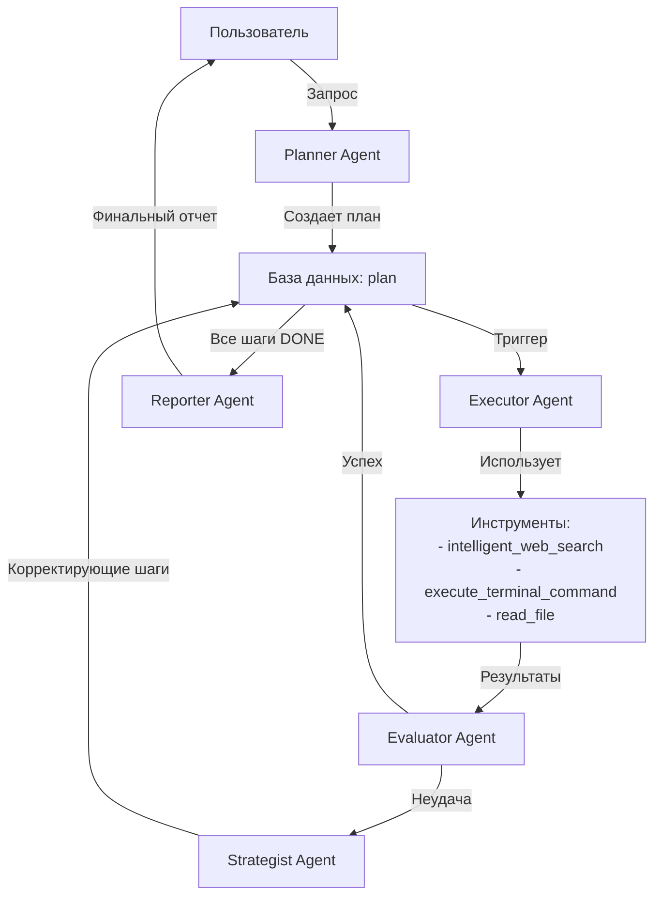

# Deep Research Swarm — Система Автоматизированных Исследований

Приложение на **Streamlit** для глубоких автоматизированных исследований на базе **OpenAI Swarm**. Система использует мульти-агентную архитектуру для планирования, выполнения и анализа исследовательских задач с поддержкой веб-поиска, выполнения команд терминала и генерации отчетов.

## Основные возможности

- **Мульти-агентная архитектура**: Пять специализированных агентов (Planner, Executor, Evaluator, Strategist, Reporter) работают совместно для выполнения сложных исследовательских задач
- **Мульти-пользовательская поддержка**: Изолированные сессии исследований для каждого пользователя с системой аутентификации
- **Безопасное выполнение команд**: Система одобрения для команд терминала с визуальным отображением статуса в GUI
- **Интеллектуальный веб-поиск**: Интеграция с SearXNG и продвинутая фильтрация результатов с использованием би-энкодеров и кросс-энкодеров
- **Персистентность данных**: SQLite база данных для сохранения состояния между сессиями
- **Docker поддержка**: Готовые конфигурации для запуска приложения и локального vLLM сервера

## Требования

- Python 3.10+ (желательно 3.11)
- `git` (нужен, потому что `swarm` ставится из GitHub)
- Для локального vLLM: Docker, NVIDIA Container Toolkit, GPU с поддержкой CUDA

## Установка

В корне репозитория:

```bash
python -m venv .venv
source .venv/bin/activate
pip install -U pip
pip install -r requirements.txt
```

## Настройка переменных окружения

Создайте файл `.env` рядом с `main.py`:

```bash
OPENAI_API_KEY=ваш_ключ

# опционально:
# OPENAI_BASE_URL=https://...
# OPENAI_MODEL=gpt-4o
# DB_NAME=research_state.db
# MAX_TURNS=25
# LOG_LEVEL=INFO
# LOG_FILE=logs/app.log
# MAX_SEARCH_RESULTS=6
# MAX_FINAL_TOP_CHUNKS=3
```

Что означает:

- **`OPENAI_API_KEY`**: обязателен (или `EMPTY` для локального vLLM).
- **`OPENAI_BASE_URL`**: опционально (например, если используете совместимый прокси/шлюз или локальный vLLM).
- **`OPENAI_MODEL`**: модель (по умолчанию `gpt-oss-20b` для локального vLLM, или `gpt-4o` для OpenAI).
- **`DB_NAME`**: имя файла SQLite (по умолчанию `research_state.db`, создаётся в папке проекта).
- **`MAX_TURNS`**: лимит ходов в одном запуске Swarm (по умолчанию `25`).
- **`LOG_LEVEL`**: уровень логов (`DEBUG`, `INFO`, `WARNING`, `ERROR`). По умолчанию `INFO`.
- **`LOG_FILE`**: путь до файла логов (если задан — логи пишутся и в консоль, и в файл с ротацией).
- **`MAX_SEARCH_RESULTS`**: максимальное количество результатов поиска для обработки (по умолчанию `6`).
- **`MAX_FINAL_TOP_CHUNKS`**: количество финальных релевантных чанков после фильтрации (по умолчанию `3`).

## Запуск

```bash
streamlit run main.py
```

После запуска откройте страницу Streamlit (ссылка будет выведена в терминале).

## Как пользоваться

### Первый запуск

1. При первом открытии приложения вам будет предложено зарегистрироваться или войти.
2. После входа создайте новый research run через кнопку **"➕ New Research Run"** в сайдбаре.
3. Введите тему исследования в поле ввода чата.

### Интерфейс

- **Сайдбар "Research Plan"**: Показывает план исследования и статусы шагов (TODO/IN_PROGRESS/DONE/FAILED) с цветовой индикацией.
- **Сайдбар "Security Approvals"**: Отображает команды терминала, ожидающие одобрения. Вы можете одобрить (✅) или запретить (❌) каждую команду.
- **Основной чат**: Показывает всю историю взаимодействия с агентами, включая:
  - Статусы одобрения команд терминала (⏳ Ожидание одобрения, ✅ Одобрено, ❌ Запрещено)
  - Результаты веб-поиска с количеством найденных источников
  - Выполненные инструменты и их результаты
  - Финальные отчеты исследования
- **Кнопки управления**: 
  - **⏸️ Pause Research**: Приостанавливает выполнение исследования
  - **▶️ Resume Research**: Возобновляет выполнение после паузы

### Процесс исследования

1. **Планирование**: Агент Planner создает план из 3-10 исследовательских шагов.
2. **Выполнение**: Агент Executor последовательно выполняет каждый шаг, используя веб-поиск, чтение файлов или выполнение команд (с одобрением).
3. **Оценка**: Агент Evaluator проверяет результаты каждого шага.
4. **Восстановление**: При неудаче шага агент Strategist создает корректирующие шаги.
5. **Отчетность**: После завершения всех шагов агент Reporter генерирует финальный отчет.

## Логи

Логи выводятся в консоль, где запущен Streamlit. Чтобы включить подробности:

```bash
LOG_LEVEL=DEBUG streamlit run main.py
```

Чтобы писать в файл:

```bash
LOG_FILE=logs/app.log streamlit run main.py
```

## Архитектура системы

### Мульти-агентная архитектура

Система использует архитектуру **OpenAI Swarm** с пятью специализированными агентами:

#### 1. **Planner (Планировщик)**
- **Роль**: Создание структурированного плана исследования
- **Инструменты**: `add_steps_to_plan`, `ask_user`
- **Выход**: План из 3-10 конкретных исследовательских задач

#### 2. **Executor (Исполнитель)**
- **Роль**: Выполнение исследовательских шагов
- **Инструменты**: `get_current_plan_step`, `intelligent_web_search`, `read_file`, `execute_terminal_command`, `answer_from_knowledge`, `ask_user`
- **Особенности**: 
  - Всегда начинает с получения текущего шага плана
  - Ограничение: максимум 3 вызова `intelligent_web_search` на шаг
  - Передает управление Evaluator после сбора данных

#### 3. **Evaluator (Оценщик)**
- **Роль**: Валидация результатов исследования
- **Инструменты**: `get_current_plan_step`, `submit_step_result`, `mark_step_failed`
- **Логика**:
  - При успехе: сохраняет результат и помечает шаг как DONE
  - При неудаче: помечает шаг как FAILED и передает управление Strategist

#### 4. **Strategist (Стратег)**
- **Роль**: Восстановление после неудач
- **Инструменты**: `insert_corrective_steps`, `add_steps_to_plan`, `get_recovery_context`, `ask_user`
- **Особенности**: Вставляет корректирующие шаги после провалившегося шага или добавляет новые шаги в конец плана

#### 5. **Reporter (Репортер)**
- **Роль**: Генерация финального отчета
- **Инструменты**: `get_research_summary`
- **Выход**: Исчерпывающий Markdown отчет, синтезирующий все результаты исследования

### Поток выполнения



### Мульти-пользовательская архитектура

Приложение поддерживает несколько пользователей с полной изоляцией данных:

- **Аутентификация**: Система регистрации и входа с хешированием паролей (bcrypt)
- **Изоляция сессий**: Каждый research run привязан к пользователю через `user_id`
- **База данных**: Все таблицы используют `run_id` для изоляции данных между сессиями

### Система безопасности команд терминала

Для обеспечения безопасности выполнения команд терминала реализована система одобрения:

1. **Запрос одобрения**: Когда агент вызывает `execute_terminal_command`, команда сохраняется в таблице `approvals` со статусом "ожидание" (0)
2. **Визуализация**: 
   - В сайдбаре отображается список команд, ожидающих одобрения
   - В основном чате показывается статус каждой команды: ⏳ Ожидание, ✅ Одобрено, ❌ Запрещено
3. **Одобрение/Запрет**: Пользователь может одобрить или запретить команду через кнопки в сайдбаре
4. **Выполнение**: Команда выполняется только после одобрения, результат возвращается агенту

### Интеграция SearXNG

Система использует **SearXNG** (метапоисковая система) для веб-поиска:

- **Конфигурация**: Настройки в `searxng/settings.yml` и `searxng/limiter.toml`
- **Поисковые движки**: Google, Brave, Wikipedia (настраиваемые)
- **API**: Доступ через `http://localhost:666/search`
- **Алгоритм фильтрации**:
  1. Получение ссылок через SearXNG
  2. Параллельное скачивание и умная нарезка текста
  3. Bi-Encoder: Векторизация и грубый отсев (Top-20)
  4. Cross-Encoder: Точная перепроверка и ранжирование (Top-3)

### Структура проекта

```
damn-so-deep-research/
├── main.py                 # Основной Streamlit интерфейс: аутентификация, управление runs, отображение чата
├── research_agents.py      # Определения всех агентов (Planner, Executor, Evaluator, Strategist, Reporter)
├── runner.py               # Логика запуска swarm в фоновых потоках, управление handoffs, контекст runs
├── database.py             # DatabaseService класс: управление SQLite, мульти-тенантность
├── db_session.py           # Адаптер между SDK agents и DatabaseService для персистентности истории
├── schema.py               # Pydantic модели для валидации данных (ChatMessage и др.)
├── config.py               # Загрузка переменных окружения из .env, настройки приложения
├── logging_setup.py        # Конфигурация системы логирования
├── requirements.txt        # Python зависимости
├── docker-compose.yml       # Конфигурация для локального vLLM и SearXNG
├── Dockerfile              # Docker образ для основного приложения
├── tools/                  # Инструменты для агентов
│   ├── search.py           # intelligent_web_search: интеграция с SearXNG, фильтрация результатов
│   ├── planning.py         # add_steps_to_plan, get_current_plan_step, insert_corrective_steps
│   ├── execution.py        # execute_terminal_command, read_file, answer_from_knowledge, ask_user
│   ├── reporting.py        # get_research_summary, submit_step_result, mark_step_failed, get_recovery_context
│   └── legacy.py           # Устаревшие инструменты
├── utils/                  # Утилиты
│   ├── web_scraper.py      # Логика веб-скрапинга и обработки URL
│   ├── text_processing.py  # Би-энкодеры, кросс-энкодеры, нарезка текста
│   └── context.py          # Контекстные переменные для разделения состояния в потоке (current_run_id)
└── searxng/                # Конфигурация SearXNG
    ├── settings.yml        # Настройки поисковых движков и параметров
    └── limiter.toml        # Настройки лимитов запросов
```

### База данных (SQLite)

Проект использует SQLite (`research_state.db`) для управления состоянием исследования. Основные таблицы:

- **`users`**: Пользователи системы (id, username, password_hash, created_at)
- **`runs`**: Исследовательские сессии (id, user_id, title, status, created_at)
- **`plan`**: План исследования (id, run_id, step_number, description, status, result, feedback)
  - Статусы: `TODO`, `IN_PROGRESS`, `DONE`, `FAILED`
- **`approvals`**: Одобрения команд терминала (command_hash, run_id, command_text, approved)
  - Статусы: `0` (ожидание), `1` (одобрено), `-1` (запрещено)
- **`messages`**: История сообщений и взаимодействий (id, run_id, role, content, tool_calls, tool_call_id, sender, session_id, task_number, timestamp)
- **`run_state`**: Состояние выполнения (run_id, key, value)
  - Ключи: `swarm_running`, `pause_requested`, `active_task`, `pending_question`, `pending_question_response`

База данных инициализируется автоматически при первом запуске через `database.py`. Используется WAL (Write-Ahead Logging) режим для лучшей конкурентности.

## Docker

### Запуск приложения

```bash
docker build -t research-swarm .
docker run -p 8501:8501 --env-file .env -v $(pwd)/logs:/app/logs -v $(pwd)/research_state.db:/app/research_state.db research-swarm
```

### Запуск vLLM и SearXNG

Мы подготовили `docker-compose.yml` с правильными настройками для локального запуска:

1. **Требования**: Docker и NVIDIA Container Toolkit (для vLLM)
2. **Настройка токена Hugging Face** (если модель требует доступа):
   ```bash
   export HUGGING_FACE_HUB_TOKEN=your_token_here
   ```
3. **Запуск**:
   ```bash
   docker compose up -d
   ```

Это запустит:
- **vLLM сервер** на `http://localhost:8001/v1` с моделью `openai/gpt-oss-20b`
- **SearXNG** на `http://localhost:666`

Настройки в `.env` для работы с локальным vLLM:

```bash
OPENAI_BASE_URL=http://localhost:8001/v1
OPENAI_API_KEY=EMPTY
OPENAI_MODEL=openai/gpt-oss-20b
```

### Конфигурация SearXNG

SearXNG запускается как отдельный сервис в Docker Compose. Конфигурация находится в `searxng/`:
- `settings.yml`: Настройки поисковых движков (Google, Brave, Wikipedia)
- `limiter.toml`: Настройки лимитов запросов

По умолчанию SearXNG доступен на порту 666 и интегрирован в инструмент `intelligent_web_search`.

## Дополнительная информация

### Логика работы агентов

#### Фаза 1: Планирование

**Агент: `Planner` (Планировщик)**
- **Триггер**: Пользователь вводит тему исследования
- **Контекст**: Исходный запрос пользователя, пустой или существующий план
- **Действия**: 
  - Вызывает `add_steps_to_plan` с 3-10 конкретными исследовательскими задачами
  - Возвращает "Plan Created"

#### Фаза 2: Выполнение (Цикл)

Эта фаза выполняется в цикле для каждого шага плана. Агенты используют память в рамках задачи, видя только историю текущего активного шага.

**Агент: `Executor` (Исполнитель)**
- **Триггер**: Система выбирает следующий шаг со статусом `TODO`
- **Контекст**: Системный триггер "Execute Step X", статус плана, история текущего шага
- **Действия**:
  - Всегда начинает с `get_current_plan_step`
  - Использует `intelligent_web_search`, `read_file`, `execute_terminal_command` для сбора данных
  - Передает управление `Evaluator` после сбора информации

**Агент: `Evaluator` (Оценщик)**
- **Триггер**: Handoff от `Executor` с собранными данными
- **Контекст**: Полный контекст Executor + последние результаты инструментов
- **Действия**:
  - При успехе: вызывает `submit_step_result` и помечает шаг как `DONE`
  - При неудаче: вызывает `mark_step_failed` и передает управление `Strategist`

**Агент: `Strategist` (Стратег)** (только при неудаче)
- **Триггер**: Handoff от `Evaluator` после неудачи
- **Контекст**: Контекст сбоя, текущее состояние плана
- **Действия**:
  - Вызывает `insert_corrective_steps` для вставки корректирующих шагов
  - Или `add_steps_to_plan` для добавления шагов в конец
  - Передает управление `Executor` для повторной попытки

#### Фаза 3: Отчетность

**Агент: `Reporter` (Репортер)**
- **Триггер**: Все шаги в плане помечены как `DONE`
- **Контекст**: Системный триггер "All steps completed", план выполнен на 100%
- **Действия**:
  - Вызывает `get_research_summary` для получения всех результатов
  - Генерирует исчерпывающий Markdown отчет, синтезирующий все данные
  - Отчет должен включать: "Автор исследования: damn-so-deep-research"

### Особенности реализации

- **Контекст выполнения**: Каждый run имеет свой `run_id`, который используется для изоляции данных
- **Управление паузой**: Пользователь может приостановить и возобновить выполнение исследования
- **Вопросы к пользователю**: Агенты могут задавать вопросы через инструмент `ask_user` в критических ситуациях
- **Оптимизация контекста**: Система автоматически обрезает большие результаты инструментов для экономии контекста
- **Обработка ошибок**: При сбоях агент Strategist создает корректирующие шаги для восстановления